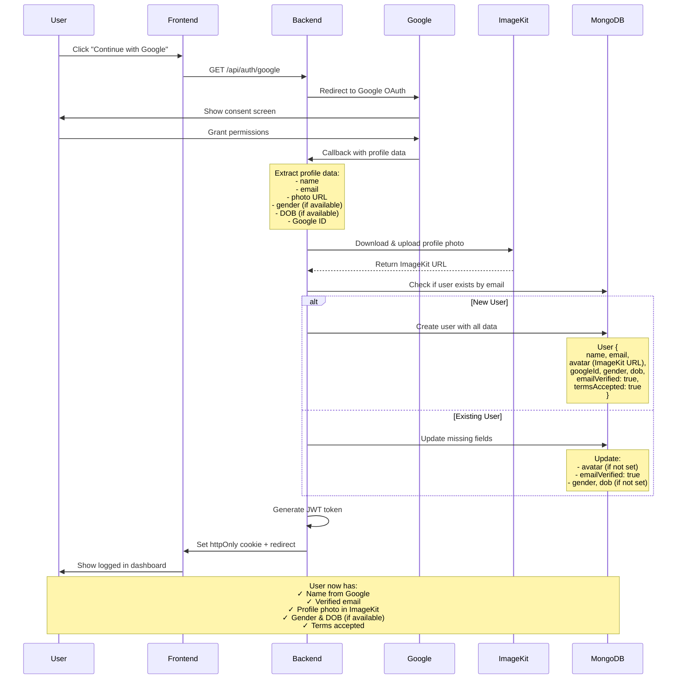
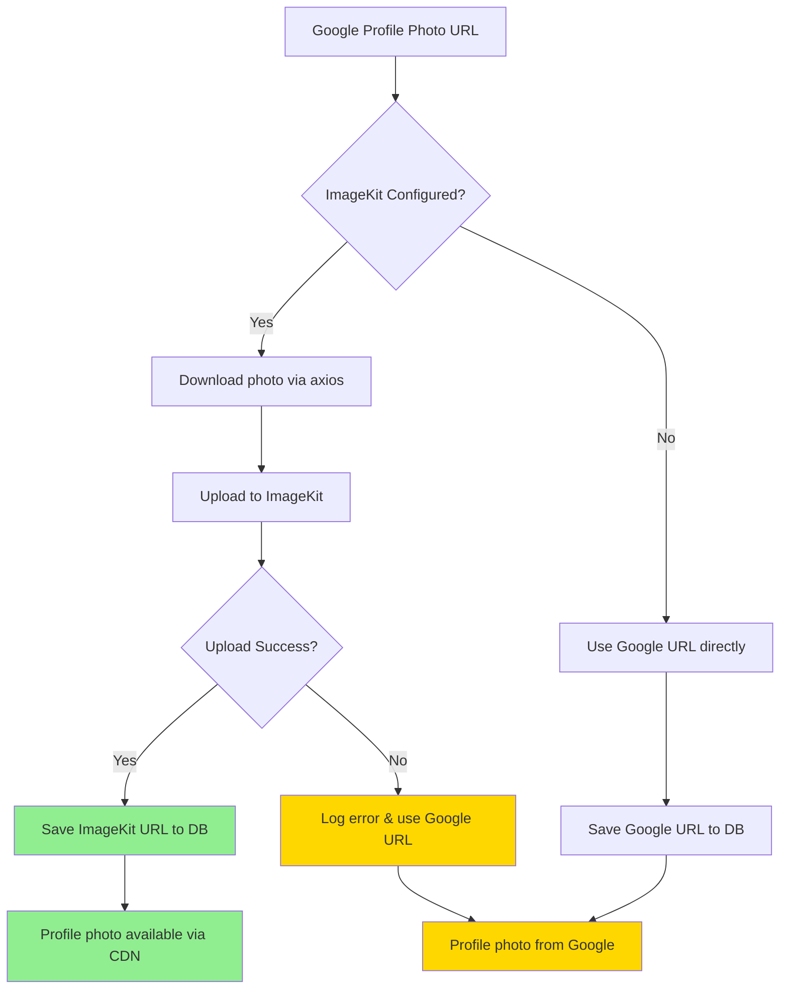
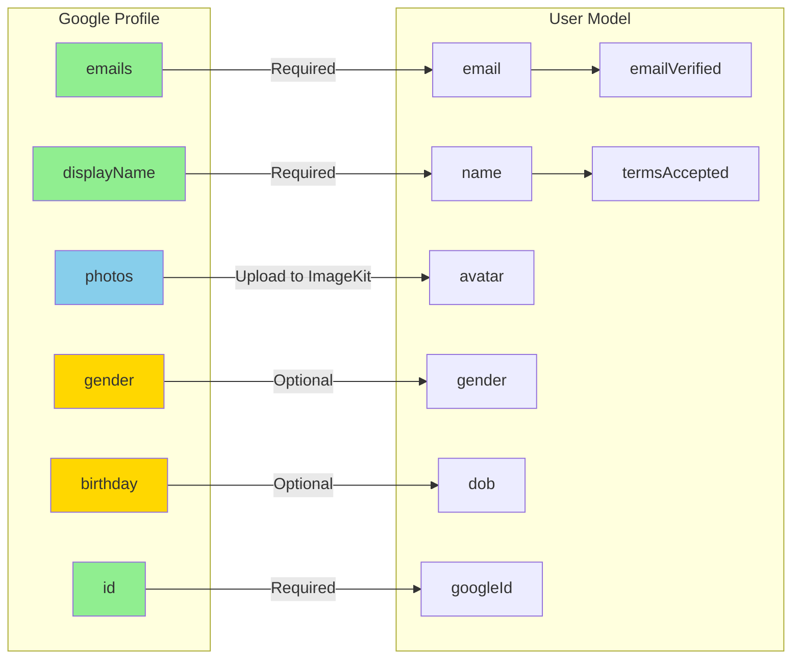
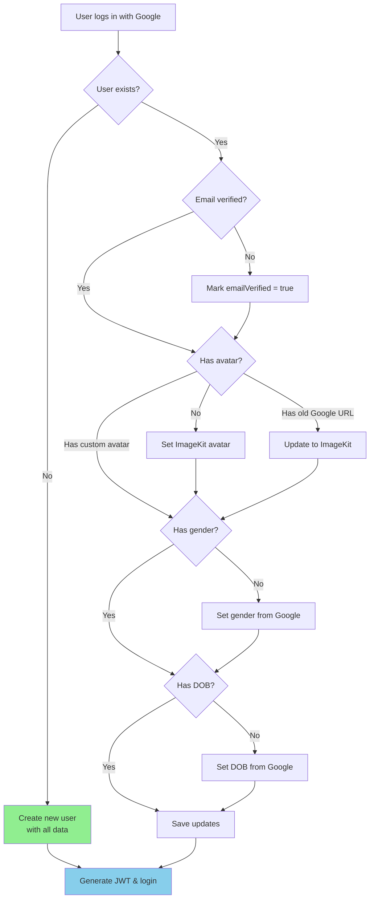

# Google OAuth Enhanced Flow Diagram

## Complete Authentication & Profile Data Flow



## Profile Photo Upload Flow



## Data Extraction Priority



## Smart Update Logic for Existing Users



## File Organization

```
node-backend/
├── src/
│   ├── config/
│   │   └── passport.js ⭐ ENHANCED - Full profile extraction
│   ├── models/
│   │   └── User.js ⭐ ENHANCED - Added googleId field
│   ├── utils/
│   │   └── imagekit-upload.js ✨ NEW - ImageKit utility
│   └── routes/
│       └── auth.js (OAuth routes)
└── package.json ⭐ UPDATED - Added axios
```

## Environment Variables

```env
# Required for OAuth
GOOGLE_CLIENT_ID=your_google_client_id
GOOGLE_CLIENT_SECRET=your_google_client_secret
GOOGLE_CALLBACK_URL=http://localhost:4000//api/auth/google/callback

# Required for ImageKit photo storage
IMAGEKIT_PUBLIC_KEY=public_xxxxx
IMAGEKIT_PRIVATE_KEY=private_xxxxx
IMAGEKIT_URL_ENDPOINT=https://ik.imagekit.io/xxxxx
```

## ImageKit Storage Structure

```
ImageKit Media Library
└── avatars/
    └── google/
        ├── google_123456789_1734567890123.jpg
        ├── google_987654321_1734567890456.jpg
        └── google_555555555_1734567890789.jpg
```

**Naming**: `google_{googleId}_{timestamp}.jpg`

## Testing Checklist

- [ ] User can sign in with Google
- [ ] Name extracted from Google profile
- [ ] Email marked as verified
- [ ] Profile photo uploaded to ImageKit
- [ ] ImageKit URL saved in database
- [ ] Gender extracted (if available)
- [ ] DOB extracted (if available)
- [ ] Google ID stored in database
- [ ] Existing users updated correctly
- [ ] JWT cookie set properly
- [ ] User redirected to frontend

---

**Implementation Date**: December 19, 2025  
**Status**: ✅ Complete and ready for testing
